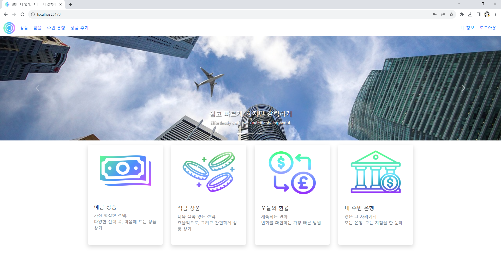
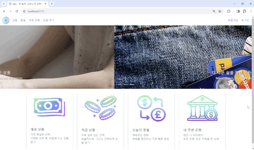
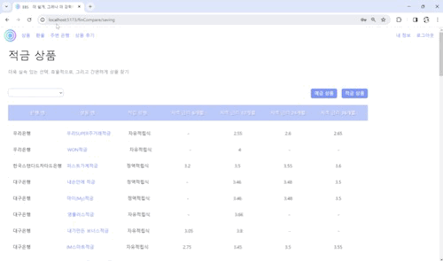
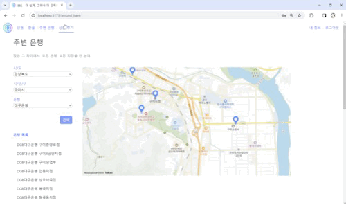
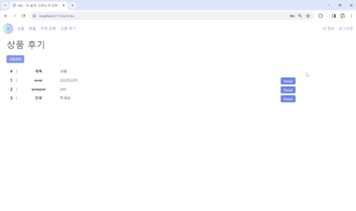

# EBS

Easier, But Stronger : 더 쉽고 강력한 금융 애플리케이션

삼성 청년 SW 아카데미 1학기 관통 프로젝트<br>

---



---

## 목차

[개요](#개요)

[프로젝트 소개](#프로젝트-소개)

- 프로젝트 기간

- 기술 스택

- 팀원 정보 및 업무 분담 내역

- 설계 내용 및 실제 구현 정도

- 데이터베이스 모델링(ERD)

[기능 소개](#기능-소개)

- 금융 상품 추천 알고리즘

- 서비스 대표 기능

- 기능 시연

[프로젝트 후기](#프로젝트-후기)

---

## 개요

- 금융 상품 비교 애플리케이션

<br>

## 프로젝트 소개

### 프로젝트 기간

- 2023년 11월 16일(목) ~ 2023년 11월 23일(목)

- 2023년 11월 24일(금) 발표<br>

### 기술 스택

**[ FRONT-END ]**

- **Vue.js**
- **Node.js LTS**
- **HTML, CSS**
- **BootStrap 5.3.2**

**[ BACK-END ]**

- **Python 3.8**
- **Django 3.2**

**[ 소스 코드 관리 ]**

- **GitLab**

<br>

### 팀원 정보 및 업무 분담 내역

| 이름  | 역할  | 구현 기능                                                                                                             |
| --- | --- | ----------------------------------------------------------------------------------------------------------------- |
| 이해진 | 팀장  | Back-End 전반 : Rest API, DB 테이블, <br/>게시판 기능 구현, 회원 커스터마이징<br/>Front-End 전반 : <br/>Bootstrap, CSS, Vue를 통한 웹페이지 구성 |
| 편수지 | 팀원  | DataBase ERD, PPT, README <br/>Back-End: 금융 상품 추천 알고리즘<br/>Front-End: 카카오 Map, 환율계산기                              |

### 데이터베이스 모델링(ERD)

## 기능 소개

### 금융 상품 추천 알고리즘

**기본 로직 _ 회원의 재산, 연봉 정보를 바탕으로 적합한 예금 & 적금 상품 추천**

1. 재산 상위 20%와 중위+하위 분류

2. 상위 20% 회원에게는 24/36개월 장기 & 복리 상품 추천

3. 중위+하위 회원에게는 6/12개월 단기 상품 추천

```python
tax_rate = 0.06

        if 14_000_000 <= b['salary'] <= 50_000_000:

            tax_rate = 0.15

        if b['salary'] >= 50_000_000:

            tax_rate = 0.24

        # 매달 납입할 금액 month_saving

        month_saving = int(b['salary'] * tax_rate / 12 * 0.4)
```

4. 연봉  세금 계산 후 * 0.4  (40% 저축 가정)

5. 매달 저축 가능한 금액이 높을수록(고연봉일수록)

6. 상품의 월 최대 납입 금액 높은 상품 내림차순으로 정렬하여 추천

### 서비스 대표 기능

| 구분         | 기능                         | 설명                                                                                                                                             |
| ---------- | -------------------------- | ---------------------------------------------------------------------------------------------------------------------------------------------- |
| 회원         | 회원가입<br/>로그인<br/>로그아웃      | - `dj-rest-auth`를 이용한 회원가입, 로그인, 로그아웃 구현                                                                                                       |
| 예/적금 상품 정보 | 상품별 금리 비교<br/>은행 별 상품 모아보기 | - 금융감독원 API 활용<br/>- 예금 상품에 대한 상품 목록 전체 조회<br/>- 적금 상품에 대한 상품 목록 전체 조회<br/>- 은행 별 필터링을 통해 특정 은행 상품만 조회                                         |
| 예/적금 상품 정보 | 개별 상품 별 세부 정보              | - 금융감독원 API 활용<br/>- 특정 상품 선택 시 해당 상품의 세부 정보 조회(상품 명, 은행 명, 가입 방법, 가입 대상, 우대 금리 조건, 만기 조건, 유의 사항, 이자율 적용 방법, 가입 기간 별 이자율 등)                    |
| 환율         | 외국 통화 - 국내 통화 환전           | - 외국 국가 선택 및 환전할 금액 입력 시 환율 정보 적용하여 국내 통화 금액으로 변환<br/>- 외국 국가 선택 및 국내 통화 금액 입력 시 환율 정보 적용하여 외국 통화 금액으로 변환                                      |
| 은행 조회      | 주변 은행 조회                   | - 카카오Map API 활용<br/>- 시/도, 시/군/구, 은행 정보 선택 후 검색 시 해당 은행 정보 조회                                                                                  |
| 상품 후기      | 게시판                        | - 게시글 작성, 수정, 삭제, 조회<br/>- 본인이 작성한 게시글에 대해서만 작성, 수정, 삭제 가능                                                                                     |
| 마이페이지      | 사용자                        | - 회원 정보 조회 (닉네임, 나이, 보유자산, 월급, 가입 상품)<br/>- 금융 상품 추천 받기                                                                                        |
| 금융 상품 추천   | 금융 상품 추천 알고리즘              | - 파레토 법칙 기반의 금융 상품 추천<br/>- 회원의 재산, 연봉 정보를 바탕으로 재산 상위 20%와 중위+하위 분류<br/>- 상위 20% 회원에게는 24/36개월 장기 & 복리 상품 추천<br/>- 중위+하위 회원에게는 6/12개월 단기 상품 추천 |

### 기능 시연

#### ❤ 홈


#### 🧡 회원: 회원 가입



#### 🧡 회원: 로그인


#### 💛 예/적금 상품 정보: 상품별 금리 비교, 개별 상품 세부 정보


#### 💚 환율 계산



#### 💙 주변 은행 조회


#### 💜 상품 후기 : 게시글 작성, 조회, 수정, 삭제



#### 🖤 마이페이지, 금융 상품 추천



#### 

## 프로젝트 후기

아무것도 없는 빈 폴더에서 시작하며 완성 자체가 가능할 지에 대한 걱정이 앞섰다. 

하지만 기획 단계에서 필요한 기능과 모델을 차근차근 설계해 나가며 필요한 요소에 대해 정리해나가니 결국 모든 구현이 완성될 수 있었다.

특히, Vue를 통한 FE 구현 실력이 많이 향상됨을 느꼈다. Django에 axios 요청을 보냄으로써 데이터를 받아오고, store에 저장해오는 부분을 어려워했는데, 프로젝트 구현을 진행하며 해당 부분에 대한 이해도가 많이 향상되었다.

또한, JavaScript의 비동기적 특성때문에 구현에 있어서 많은 어려움을 겪었다. 기본적으로 store에서 axios를 요청 함수를 정의한 후, 해당 정보가 필요한 페이지에서 onMount 함수 내에서 axios 요청 함수를 불러오는 방식으로 구현을 시작했다. 다만 해당 함수를 불러온 후  결과 값을 변수에 저장하더라도, 비동기 요청에 의해 함수 실행 이전의 null 혹은 undefined 값이 반환되었다.

이러한 문제를 해결하기 위해 axios 요청의 종류와 사용 상황에 따라 store와 View 컴포넌트 내에서 적절히 분배하여 axios를 받아 오는 것이 바람직함을 깨달았다.

이번 프로젝트를 구현하며 배운 내용을 바탕으로 추후 EBS의 부족한 부분을 보완해나가고자 한다.
